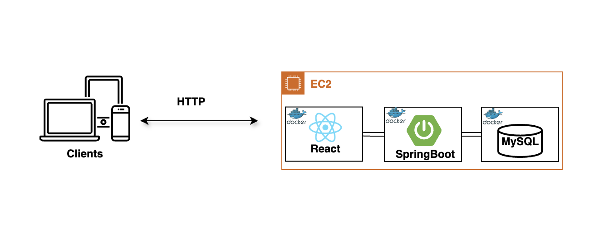

# On Demand System

An application that, upon user request, automatically containerizes itself and deploys to AWS, optimizing hosting costs. Built with Java Spring Boot backend, React frontend, MySQL database, and deployed on demand on AWS EC2 with Docker containerization. Features RESTful APIs, Cloud Architecture, and DevOps.

The point of this project is to show problem solving, system design, DevOps, and AWS cloud architecture skills, NOT what the website offers.

Checkout the github/workflow and this [article](https://medium.com/@nasser258/java-spring-boot-mysql-react-aws-full-stack-project-from-scratch-to-production-9b703563ec23) to see how I implemented this step-by-step

## Architecture

## Features

**User-Friendly Web Interface**: allowing users to view, create, and delete real estate listings.

## Technologies Used

- **Frontend**: Javascript React
- **Backend**: Java Spring Boot
- **Database**: MySQL
- **Compute**: Amazon EC2
- **Contrainer**: Docker

## Usage

1. Open the web application at [realestate.app](https://realestate258.netlify.app/) in your browser. Note: the website may not be functional at the time you use it due to AWS hosting costs, check out step-by-step guide on how I built this [here](https://medium.com/@nasser258/java-spring-boot-mysql-react-aws-full-stack-project-from-scratch-to-production-9b703563ec23)
2. On the website, click -> start EC2 instance
3. This will trigger a pipeline that will download docker containers of frontend, backend, and db to an EC2 instance in AWS
4. Then, using docker compose, start the application for 10 minutes before shutting down again. As a result, the website will become functional for 10 minutes for all users.
